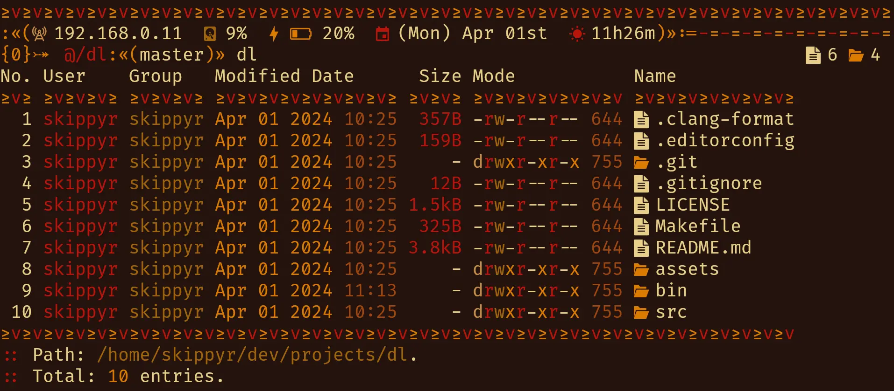

<p align="center">
    
</p>
<h1 align="center">≥v≥v&ensp;dl&ensp;≥v≥v</h1>
<p align="center">Directory Lister</p>
<p align="center">
    
    &nbsp;
    
    &nbsp;
    
    &nbsp;
    
</p>

## ❡ About

A tribal inspired directory listing utility for Linux.

<p align="center">
    
</p>
<p align="center"><sup><strong>Caption:</strong> a preview of <code>dl</code> listing a directory. The terminal theme used is <a href="https://github.com/skippyr/flamerial">Flamerial</a>, shell theme is <a href="https://github.com/skippyr/river-dreams">River Dreams</a> and font is <a href="https://fonts.google.com/specimen/Fira+Code">Fira Code</a>.</sup></p>

### Features

For each entry in a directory, it displays:

- Its index on the listing.
- Its user and group names.
- Its last modified date.
- Its size in a convenient human readable: terabyte (TB), gigabyte (GB), megabyte (MB), kilobyte (kB) or byte (B).
- The file type regular (-), directory (d), symlink (l), block device (b), character device (c), fifo (f) or socket (s).
- Its read (r), write (w), execute (x) and lack (-) permissions for user, group and others, respectively.
- Its permissions in octal base.
- An icon representing its type.
- Its name. And if it is a symlink, it also contains the path that it points to.

## ❡ Install

### Dependencies

The following dependencies must be installed before installing it:

- **git**: it will be used to clone this repository.
- **gcc**, **make**: they will be used to compile this software.
- [**Nerd Font Symbols**](https://www.nerdfonts.com/font-downloads), **Noto Sans**: these fonts provide the pretty symbols used in the software.

### Procedures

Using a terminal, follow these steps:

- Clone this repository using `git`:

```sh
git clone --depth 1 https://github.com/skippyr/dl;
```

- Access the repository directory using `cd`:

```sh
cd dl;
```

- Use `make` to build and install it:

```sh
make install clean;
```

- Add the install directory, `~/.local/share/bin`, to your `PATH` system environment variable by adding the following line to your shell startup file:

```sh
export PATH=${PATH}:~/.local/share/bin;
```

- Reopen your shell.

## ❡ Documentation

For a quick help about its usage syntax and available options, use its `--help` option:

```sh
dl --help;
```

## ❡ Help

If you need help related to this project, open a new issue in its [issues pages](https://github.com/skippyr/dl/issues) or send me an [e-mail](mailto:skippyr.developer@gmail.com) describing what is going on.

## ❡ Contributing

This project is open to review and possibly accept contributions, specially fixes and suggestions. If you are interested, send your contribution to its [pull requests page](https://github.com/skippyr/dl/pulls) or to my [e-mail](mailto:skippyr.developer@gmail.com).

By contributing to this project, you agree to license your work under the same license that the project uses.

## ❡ License

This project is licensed under the BSD-3-Clause License. Refer to the `LICENSE` file that comes in its source code for license and copyright details.

&ensp;
<p align="center"><sup><strong>≥v≥v&ensp;Here Be Dragons!&ensp;≥v≥</strong><br />Made with love by skippyr <3</sup></p>
