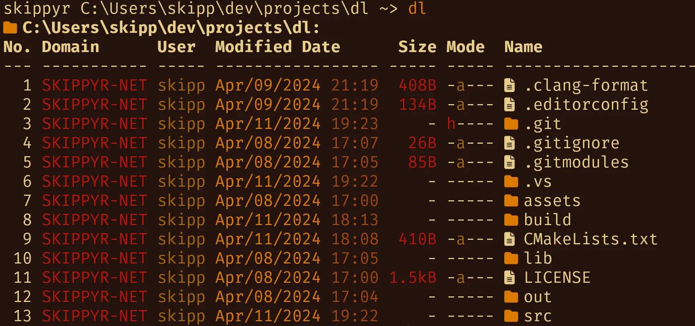
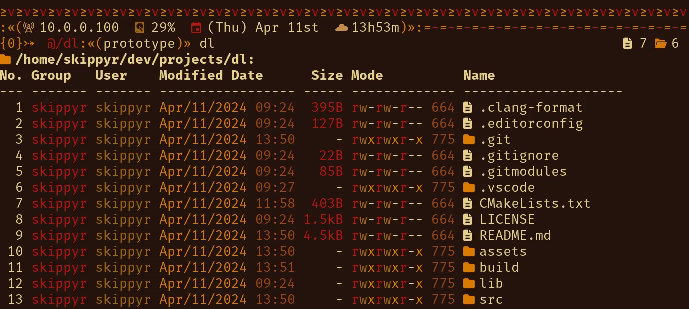

<p align="center">
	
</p>
<h1 align="center">≥v≥v&ensp;dl&ensp;≥v≥v</h1>
<p align="center">Directory Lister</p>
<p align="center">
	
	&nbsp;
	
	&nbsp;
	
	&nbsp;
	
</p>

## ❡ About

A simple directory listing utility for Windows and Linux.

<p align="center">
	
	
</p>
<p align="center"><sup><strong>Caption:</strong> two previews of <code>dl</code> listing a directory on Windows and Linux, respectively. The terminal theme used is <a href="https://github.com/skippyr/flamerial">Flamerial</a>, the Linux shell theme is <a href="https://github.com/skippyr/river-dreams">River Dreams</a> and font is <a href="https://fonts.google.com/specimen/Fira+Mono">Fira Mono</a>.</sup></p>

### Features

For each entry in a directory, it displays:

- On Windows:
	- Its index on the listing.
	- Its domain and user names.
	- Its last modified date.
	- Its size in a convenient human readable: terabyte (TB), gigabyte (GB), megabyte (MB), kilobyte (kB) or byte (B).
	- Its hidden (h), archive (a), read-only (r), temporary (t), recurse-point (l) and lack (-) attributes.
	- An icon representing its type.
	- Its name.
- On Linux:
	- Its index on the listing.
	- Its group and user names.
	- Its last modified date.
	- Its size in a convenient human readable: terabyte (TB), gigabyte (GB), megabyte (MB), kilobyte (kB) or byte (B).
	- Its read (r), write (w), execute (x) and lack (-) permissions for user, group and others, respectively.
	- Its permissions in octal base.
	- An icon representing its type.
	- Its name. And if it is a symlink, it also contains the path that it points to.

## ❡ Install

### Dependencies

The following dependencies must be installed before installing it:

#### Dependencies For Windows

- [**Visual Studio 2022**](https://visualstudio.microsoft.com): it provides all the tools required to build this software.
- [**git**](https://git-scm.com): it will be used to clone this repository.
- [**Nerd Font Symbols**](https://www.nerdfonts.com/font-downloads): this font provides the pretty symbols used in the software.

#### Dependencies For Linux

- **gcc**, **cmake**, **ninja**: they will be used to build this software.
- **git**: it will be used to clone this repository.
- [**Nerd Font Symbols**](https://www.nerdfonts.com/font-downloads), **Noto Sans** and **Noto Sans Emoji**: these fonts provide the pretty symbols used in the software.

### Procedures

On Windows, using `Developer PowerShell For VS 2022`, or, on Linux, using any terminal, follow these steps:

- Clone this repository using `git`:

```sh
git clone --recurse-submodules --depth 1 https://github.com/skippyr/dl;
```

- Access the repository directory using `cd`:

```sh
cd dl;
```

- Use `cmake` to build and install it:

```sh
cmake -B build/cmake -G Ninja;
cmake --build build/cmake;
cmake --install build/cmake;
```

- Add the install directory, `build/bin`, to your `PATH` system environment variable.
- Reopen your shell.

## ❡ Documentation

For a quick help about its usage syntax and available options, use its `--help` option:

```sh
dl --help;
```

## ❡ Help

If you need help related to this project, open a new issue in its [issues pages](https://github.com/skippyr/dl/issues) or send me an [e-mail](mailto:skippyr.developer@gmail.com) describing what is going on.

## ❡ Contributing

This project is open to review and possibly accept contributions, specially fixes and suggestions. If you are interested, send your contribution to its [pull requests page](https://github.com/skippyr/dl/pulls) or to my [e-mail](mailto:skippyr.developer@gmail.com).

By contributing to this project, you agree to license your work under the same license that the project uses.

## ❡ License

This is free software licensed under the BSD-3-Clause License that comes WITH NO WARRANTY. Refer to the `LICENSE` file that comes in its source code for license and copyright details.

&ensp;
<p align="center"><sup><strong>≥v≥v&ensp;Here Be Dragons!&ensp;≥v≥</strong><br />Made with love by skippyr <3</sup></p>
