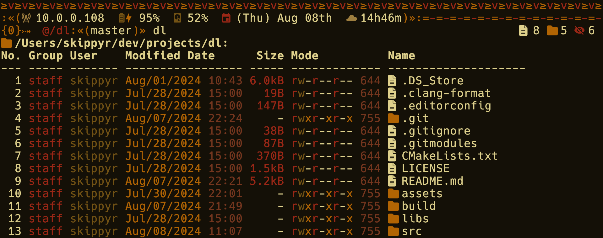
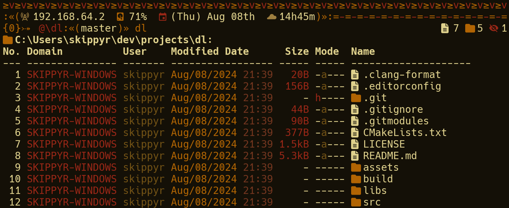

<p align="center">
  
</p>
<h1 align="center">≥v≥v&ensp;dl&ensp;≥v≥v</h1>
<p align="center">Directory Lister</p>
<p align="center">
  
  &nbsp;
  
  &nbsp;
  
  &nbsp;
  
</p>

## ❡ About

An enhanced directory listing utility available for Windows, Linux and MacOS. It includes new features such as a new data layout, colors and icons, improving usability and readability.

<p align="center">
  
  
</p>
<p align="center"><strong>Caption:</strong> <code>dl</code> being used to list a directory on MacOS and Windows. Terminal theme is <a href="https://github.com/skippyr/flamerial">Flamerial</a>. Shell theme is <a href="https://github.com/skippyr/river-dreams">River Dreams</a>. Font is Fira Code (patched by the <a href="https://www.nerdfonts.com/font-downloads">Nerd Fonts project</a>).</p>

> [!NOTE]
> The font and colors used in the software may be affected by your terminal settings. Images for illustration purpose only.

## ❡ Install

### Dependencies

The following dependencies must be installed before it:

#### Dependencies For Windows

- **[Visual Studio 2022](https://visualstudio.microsoft.com) with the "Desktop development with C++" workload:** it provides all the tools required to build this sofware.
- **[Git](https://git-scm.com):** it will be used to clone this repository.
- **A font patched by the [Nerd Fonts project](https://www.nerdfonts.com/font-downloads):** it provides the pretty symbols used by the software.

#### Dependencies For Linux

- **GCC, CMake:** they will be used to build this sofware.
- **Git**: it will be used to clone this repository.
- **A font patched by the [Nerd Fonts project](https://www.nerdfonts.com/font-downloads):** it provides the pretty symbols used by the software.

> [!TIP]
> Use your distro package manager to install these packages.

#### Dependencies For MacOS

- **Apple Command Line Tools**, **CMake**: they will be used to build this sofware.
- **Git**: it will be used to clone this repository.
- **A font patched by the [Nerd Fonts project](https://www.nerdfonts.com/font-downloads):** it provides the pretty symbols used by the software.

> [!TIP]
> Use `xcode-select --install` to install the Apple command line tools. For the rest, use [HomeBrew](https://brew.sh/).

### Procedures

On Windows, using the `Developer PowerShell for VS 2022` profile or, on any other operating systems, using any terminal, follow these instructions:

- Clone this repository using `git`:

```zsh
git clone --depth 1 --recurse-submodules https://github.com/skippyr/dl;
```

- Access its directory:

```zsh
cd dl;
```

- Use `cmake` to build and install it:

```zsh
cmake -B build/cmake;
cmake --build build/cmake --config release;
cmake --install build/cmake;
```

- Add the directory `build/bin` that was generated during the build to your system `PATH` environment variable.
- Reload your shell session.
- `dl` should now be installed and available as a command.

## ❡ Documentation

After installed, you can read its help page for usage instructions:

```zsh
dl --help
```

## ❡ Help

If you need help related to this project, open a new issue in its [issues page](https://github.com/skippyr/dl/issues) or send me an [e-mail](mailto:skippyr.developer@icloud.com) describing what is going on.

## ❡ Privacy

This software does not collect, store or share any user data. It only gathers the minimal information needed for its functionality, and this data is discarded once its execution is over. Its source code is available for reviews. If you have any questions about it, open a new issue in its [issues page](https://github.com/skippyr/dl/issues) or send me an [e-mail](mailto:skippyr.developer@icloud.com) describing what is going on.

## ❡ Contributing

This project is open to review and possibly accept contributions, specially fixes and suggestions. If you are interested, send your contribution to its [pull requests page](https://github.com/skippyr/dl/pulls) or to my [e-mail](mailto:skippyr.developer@icloud.com).

By contributing to this project, you agree to license your work under the same license that the project uses.

## ❡ License

This is free software licensed under the BSD-3-Clause License that comes WITH NO WARRANTY. Refer to the `LICENSE` file that comes in its source code for license and copyright details.

&ensp;
<p align="center"><sup><strong>Birth:</strong> March 30th 2024.</sup></p>
<p align="center"><sup><strong>≥v≥v&ensp;Here Be Dragons!&ensp;≥v≥</strong><br />Made with love by skippyr <3</sup></p>
